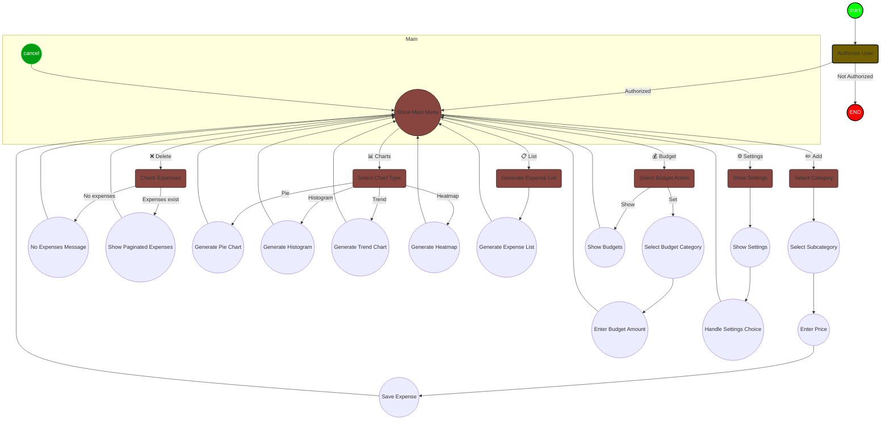

# Overview
This is a telegram bot that allows you to manage your finances on a local `.xlsx` file and add, delete, create an expense list, show charts and set budgets with alerts. In addition, you can synchronize it with Google Sheets.
## ToC

- [Demo](#demo)
- [What's new](#whats-new)
- [Next features](#next-features)
- [Features](#features)
- [Installation](#installation)
- [Usage](#usage)
- [Mermaid-based state diagram](#mermaid-based-state-diagram)
- [(Optional) Run with Docker](#optional-run-with-docker)
- [(Optional) Setting as Systemd service](#optional-setting-as-systemd-service)
- [Contributing](#contributing)

## Demo

<div align="center">
  <video src="https://github.com/sickmz/microw/assets/24682196/5d313126-2309-4a17-9004-7fac3babe1cb" width="400" />
</div>

## What's new
- 📝 **Local `.xlsx` file management**: now by default all saved, deleted expenses, charts and lists are produced locally, under your control.
- 🌐 **Sync with Google Sheet**: you can synchronize the last expenses you entered in your local `.xlsx` directly to Google Sheets.
    - **Automatic sync**: a background task wakes up every few minutes (configurable) and sync new expenses (if there are any new ones) with your Google Sheets. You can enable or disable Google Sheets synchronization via the `⚙️ Settings` command.
- All operations are now ***extremely faster*** because of the work being done locally. Google's API is very slow, so a batch synchronization of expenses is the best solution to ensure maximum responsiveness.
- ⚙️To improve readability and maintenance, the code was split into modules.
- 💰 Budgeting Feature: You can now set a budget for different expense categories and track your spending against these budgets.
    - Receive notifications when your spending exceeds the set budget for any category. You can enable or disable budget notifications via the `⚙️ Settings` command.
- Docker image
- Mermaid-based state diagram

## Next features
- [x] ~~Initial decision screen between Google Sheets and *save data locally* in .csv format with ability to export and share (for those not planning to use gsheet)~~
- [x] ~~Improve the speed of execution for the elimination of an expense~~
- [x] ~~Simplify the code and make it more modular~~
- [x] ~~Creation of budgets with alerts if exceeded~~
- [x] ~~Docker image~~
- [ ] Income management
- [ ] Cash account
- [ ] Investments

## Features
- `✏️ Add` expense with two dependent lists, category and subcategory.
- `❌ Delete` expense with pagination to go back through older expenses.
- `📊 Charts` of four types: yearly and monthly breakdowns, trends, and heatmaps.
- `📋 List` to displays a summary of expenses for the current year.
- `💰 Budget` set a budget for different expense categories.
- `⚙️ Settings` show the system settings (currently Google Sheet sync and budget alerts).

## Installation

- Clone the repository:

```
git clone https://github.com/sickmz/microw.git
cd microw
```

- Create a virtual environment:

```
python3 -m venv venv
source venv/bin/activate
```

- Install the required packages:

```
pip install -r requirements.txt
```

- Create a Google Service Account
  - Go to the [Google Cloud Console](https://console.cloud.google.com/).
  - Create a new project or select an existing one.
  - Enable the Google Sheet Api for this project.
  - Navigate to the "APIs & Services" > "Credentials" section.
  - Click "Create credentials" > "Service account".
  - Fill in the service account details and click "Create".
  - Click "Furnish a new private key" > "JSON" > "Create". The JSON file will be downloaded automatically.
  - Rename the downloaded file to credentials.json and place it in the root directory of the project.
  - Share your spreadsheet with the email of Google Service Account.

- Environments configurations: create a `.env` file in the root directory of the project with `touch .env`
- Open the `.env` file in a text editor and add the following lines, replacing the placeholders with your actual values:

```
TELEGRAM_BOT_TOKEN=your_telegram_token_bot
TELEGRAM_USER_ID=your_telegram_user_id
REMOTE_SPREADSHEET_ID=your_remote_remote_spreadsheet_id
REMOTE_EXPENSE_SHEET=your_remote_expense_sheet_name
```

- Make sure to add `.env` and `credentials.json` to your `.gitignore` file to prevent accidental commits.

## Usage

1. Start a conversation with the bot on Telegram.
2. Use the `/start` command to initiate interaction.
3. Choose an action: `✏️ Add`, `❌ Delete`, `📊 Charts`, `📋 List`, `💰 Budget` or `⚙️ Settings`.
4. Follow the bot's prompts.
5. I recommend setting the custom `/cancel` command on BotFather to cancel an operation (for example interrupting the entry of an expense).

## Mermaid-based state diagram


To see how this diagram is made you can look at [this](https://github.com/sickmz/microw/blob/main/microw.mmd?short_path=34ba1cf) file.



## (Optional) Run with Docker

The command `docker compose up -d` will automatically build the docker image, just make sure to pass the `.env` file and `credentials.json` as volumes. In the repo I uploaded a sample of `docker-compose.yaml`. To install Docker look at [this](https://gist.github.com/sickmz/2fe45975a56adcdd3d9f67842064f796#file-docker-installation) gist.

## (Optional) Setting as Systemd Service:

1. Create a new systemd service file:

```
sudo nano /etc/systemd/system/microw.service
```

2. Copy the following content into the file:

```
[Unit]
Description=microw
After=network.target

[Service]
Type=simple
ExecStart=/home/$USER/code-server/workspace/microw/venv/bin/python3 main.py
WorkingDirectory=/home/$USER/code-server/workspace/microw

[Install]
WantedBy=multi-user.target
```

3. Replace the ExecStart and WorkingDirectory paths with the actual paths to your script and project directory.

4. Reload the systemd daemon, enable and start the service:

```
sudo systemctl daemon-reload
sudo systemctl enable microw.service
sudo systemctl start microw.service
```

4. Check the service status:

```
sudo systemctl status microw.service
```


## Contributing

Pull requests are welcome. For major changes, please open an issue first to discuss what you would like to change.